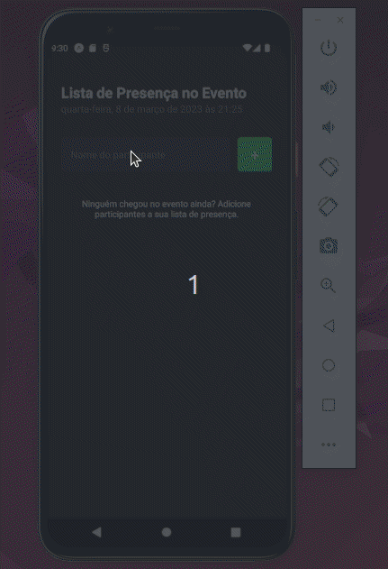

  <h3 align="center">Mobile</h3>
  

## :book: Rodar Aplicação

1- Abrir o terminal e colocar o comando:
    npm install

2- Usar o comando :
    expo start

3- instalar o expo no celular

4- Abrir o apk do expo no celular

5- Usar o leitor de QRcode do aplicativo expo para ler o QRcode do terminal

6- Aproveitar o apicativo :D

## :rocket: Tecnologias

- 
  >
- 
  >
- 
  >

## Contato

 
  
   
 

